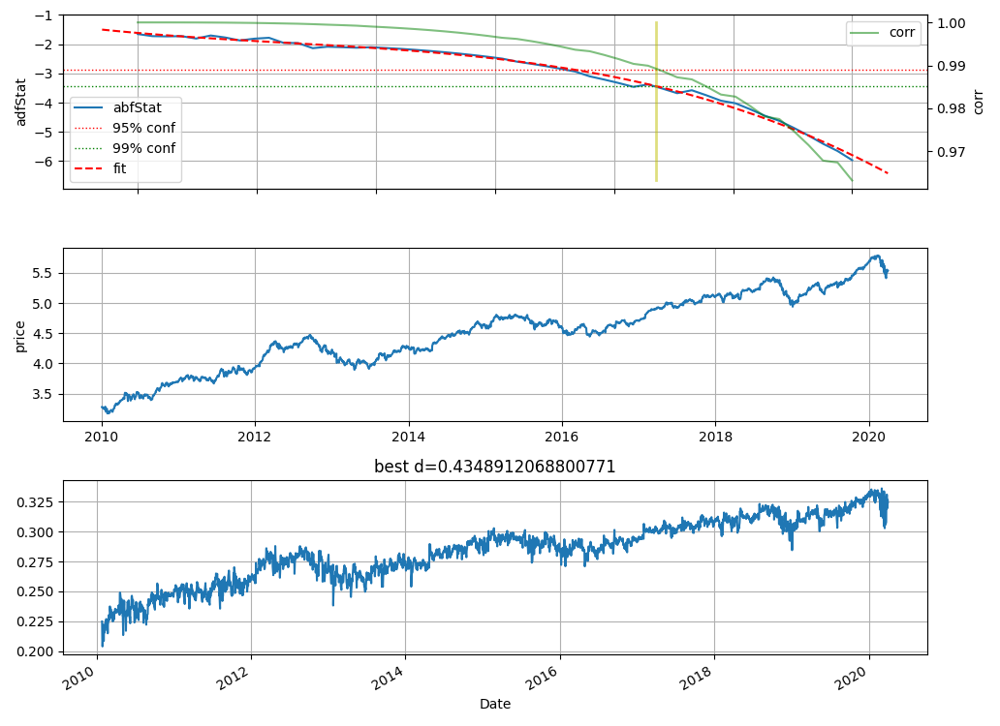
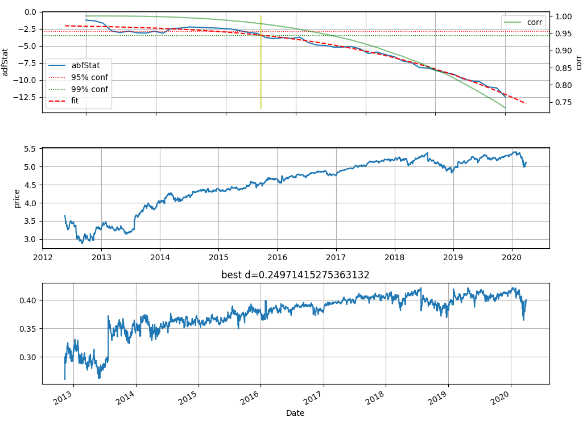
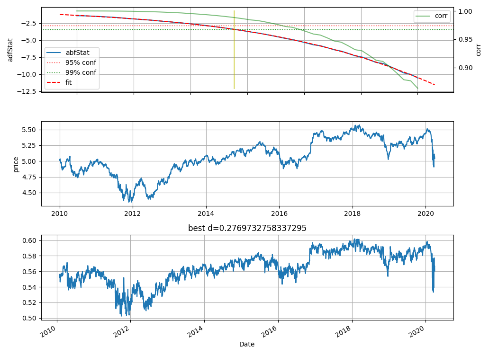
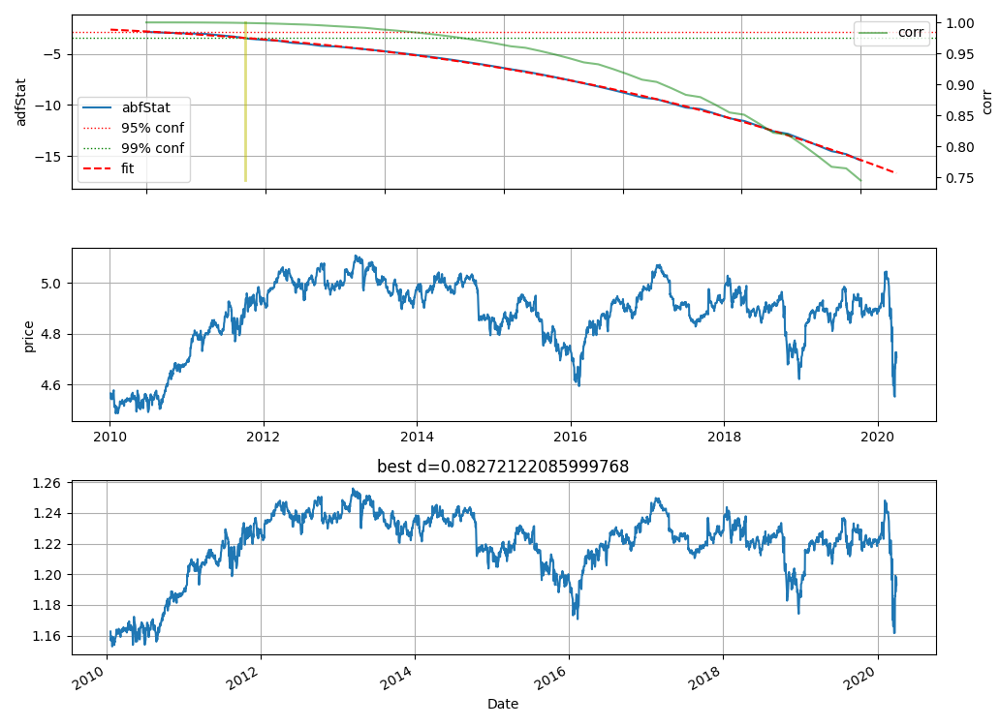
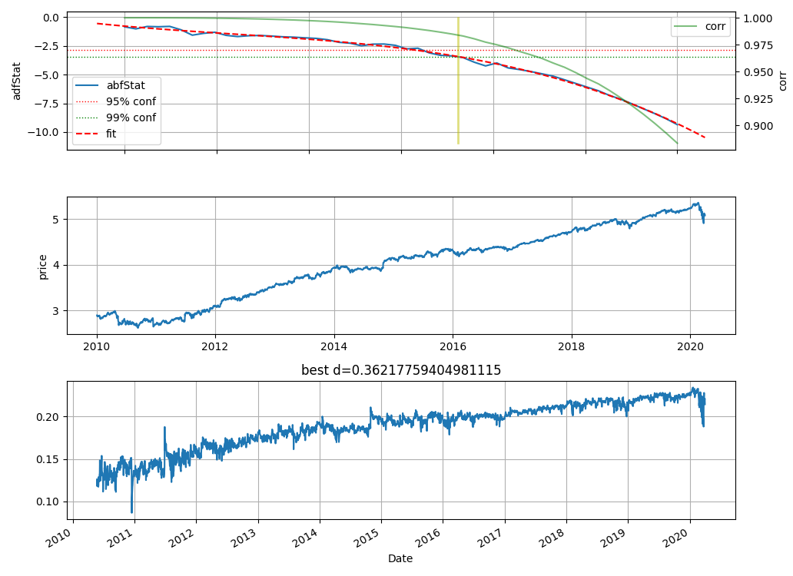
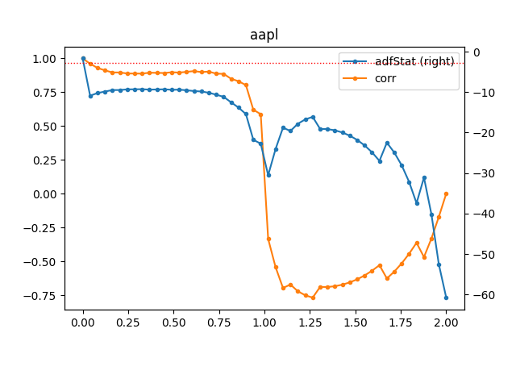

# Fractional Differentiation on Time Series

Corrected and sanitized version of code from Advances of Machine Learning by Marcos Prado.

## Comparison to Prado's original code

    In [176]: import mlfinlab.features.fracdiff as fd
         ...: import fracdiff.fracdiff as fd_
         ...: x = np.random.randn(10000)
         ...: s = pd.DataFrame(x)

    In [177]: %timeit a = fd.frac_diff_ffd(s, 0.5, thresh=1e-4)
         ...:
    1.31 s ± 16.5 ms per loop (mean ± std. dev. of 7 runs, 1 loop each)

    In [178]: %timeit b = fd_.frac_diff_ffd(x, 0.5, thres=1e-4)
         ...:
    1.77 ms ± 10.4 µs per loop (mean ± std. dev. of 7 runs, 1000 loops each)

    In [179]:

    In [179]: a[1] = b
         ...: np.abs(a[0] - a[1]).max()
         ...:
    Out[179]: 8.881784197001252e-16

    In [180]: a.tail()
    Out[180]:
                 0         1
    9995  2.072307  2.072307
    9996 -0.504402 -0.504402
    9997  0.095372  0.095372
    9998  0.296584  0.296584
    9999  1.216419  1.216419


## Best degree of diff

AAPL
<p align="center">
  
</p>
FB
<p align="center">
  
</p>
GS
<p align="center">
  
</p>
IBM
<p align="center">
  
</p>
V
<p align="center">
  
</p>


## Diffs

<p align="center">
  
</p>

## SP500 returns

<p align="center">
  
</p>

## F(X) = X and its (frac) derivatives/antiderivates

<p align="center">
  
</p>

The animation shows the derivative operator oscillating between the antiderivative (α=−1: y = ​1⁄2⋅x2) and the derivative (α = +1: y = 1) of the simple function y = x continuously.

## Get Started

```bash
git clone git@github.com:philipperemy/fractional-differentiation-time-series.git && cd fractional-differentiation-time-series
virtualenv -p python3 venv
source venv/bin/activate
pip install . --upgrade
python frac_diff_sp500.py
```

References:
- https://www.wiley.com/en-us/Advances+in+Financial+Machine+Learning-p-9781119482086
- https://wwwf.imperial.ac.uk/~ejm/M3S8/Problems/hosking81.pdf
- https://en.wikipedia.org/wiki/Fractional_calculus
